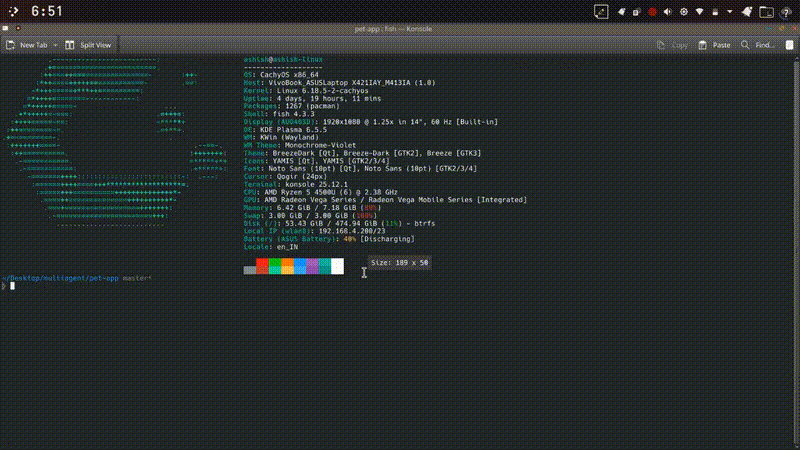

<p align="center">
  
  
  
</p>

<h1 align="center">🔐 Authent8</h1>

<p align="center">
  <strong>The security scanner that actually respects your privacy.</strong><br>
  Stop sending your precious code to the cloud just to check for bugs.
</p>

<p align="center">
  <a href="#-quick-start">Quick Start</a> •
  <a href="#-what-is-authent8">About</a> •
  <a href="#how-to-skip-certain-folders-a8ignore">Exclusions</a> •
  <a href="#-ai-setup-new">AI Setup</a> •
  <a href="#-why-it-matters">Philosophy</a>
</p>

---

## 🎬 See It In Action

### Your Daily Security Partner
Authent8 scans your code in seconds and shows you exactly what's wrong, why it's a risk, and how to fix it—all without your code ever leaving your machine.



---

## 🤔 What is Authent8?

Imagine you’re building your dream house. You wouldn't invite a stranger to walk through every room, look in your safe, and take photos of your blueprints just to check if the locks are secure, right?

**That’s what cloud-based security scanners do.** They upload your code to their servers. 

**Authent8 is different.** It’s like having a trusted security expert who comes to your house, does the inspection right there with you, and leaves without taking anything. **Your code stays 100% on your computer.**

### ✨ What can it find for you?

*   🔑 **Accidental Secrets:** Did you leave an API key or password in your code?
*   💉 **Injection Risks:** Can a hacker "inject" malicious commands into your database?
*   🖥️ **System Holes:** Are there ways for attackers to run arbitrary commands on your server?
*   📁 **File Exposure:** Can someone trick your app into reading private files?
*   📦 **Vulnerable Packages:** Are you using a library that has a known security flaw?
*   🚫 **Custom Exclusions:** Use `.a8ignore` to skip build folders, libraries, or noisy files.

---

## 🚀 Quick Start (In 60 Seconds)

### Step 1: Install
Open your terminal and paste one of these:

**Linux / macOS:**
```bash
curl -fsSL https://raw.githubusercontent.com/AshishOP/authent8/main/install.sh | bash
```

**Windows (PowerShell):**
```powershell
irm https://raw.githubusercontent.com/AshishOP/authent8/main/install.ps1 | iex
```

### Step 2: Run Your First Scan
```bash
# Scan the folder you are currently in
authent8 scan .
```

### How to skip certain folders (.a8ignore)
If Authent8 is scanning folders you don't want (like your `build` or `temp` folders), simply create a file named `.a8ignore` in your project root.

Add the folders or files you want to skip, one per line:
```text
# Ignore build artifacts
dist/
.next/
# Ignore specific files
secrets_test.py
```
Authent8 will automatically skip these and focus only on the code that matters.

---

## 🤖 AI Setup (The "Smart" Way)

Authent8 comes with a **built-in AI Setup Wizard**. You can connect your favorite AI provider (like OpenAI, Google Gemini, or even a local Ollama) to get high-quality explanations and fix suggestions for every bug found.

### How to set it up:
1. Run `authent8` to open the interactive menu.
2. Select **⚙️ Configuration**.
3. Choose **Setup AI Provider**.
4. Paste your API Key and pick a model.

**Privacy Note:** Even with AI enabled, we **never** send your whole file. We only send a tiny snippet of the specific bugged line so the AI can explain it to you.

---

## 📊 Example Report

When Authent8 finds something, it doesn't just scream at you. It gives you a clean, readable report:

```text
󰒃 authent8 v1.5.0

target: my-project  files: 24  ai: on

scanning...
✓ scan complete 2.4s

⚠ CRITICAL
  • gitleaks: 1 secret found in config.py:12
  
  [AI suggestion]: Your AWS_SECRET_KEY is exposed. Move it to an .env file.
  [Reasoning]: Hardcoded secrets can be stolen if this code is committed.

🔒 your code stayed local · 0 bytes sent to cloud
```

---

## 💡 Why Privacy Matters

Your code is your intellectual property. It contains your business logic, your unique ideas, and your internal configurations. 

Most security tools demand that you "Trust them" with your code in their cloud. We believe **Trust is earned by not asking for your data at all.**

*   ✅ **Works Offline:** Scan your code on a plane or in a bunker.
*   ✅ **Zero Tracking:** We don't track your usage, your IP, or your findings.
*   ✅ **Open Source:** You can read our code to see exactly how we keep yours safe.

---

## 🗑️ Uninstallation

We’ll be sad to see you go, but we won't make it hard:
```bash
authent8 --uninstall
```

---

## 🛠️ Built On Giants

Authent8 orchestrates the world's best open-source security engines:
*   **Trivy:** For scanning your packages/dependencies.
*   **Semgrep:** For finding dangerous code patterns.
*   **Gitleaks:** For hunting down accidentally saved passwords.
*   **Rich:** For that beautiful terminal interface.

---

<p align="center">
  <strong>Built for developers who care about privacy 🔒</strong><br>
  <a href="https://authent8.vercel.app">Official Website</a> · <a href="AI_IMPACT_STATEMENT.md">AI Impact Statement</a>
</p>

